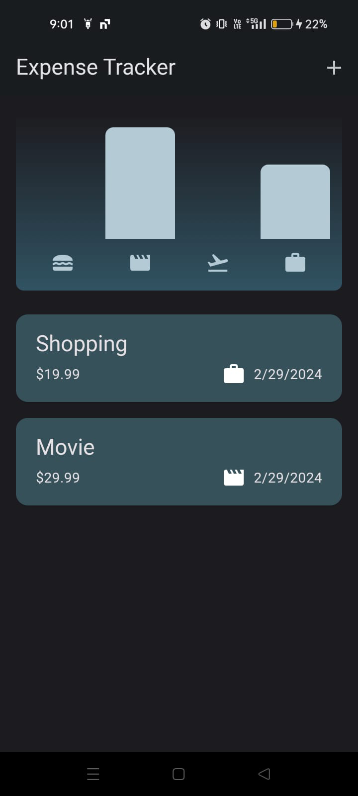

# Expense Tracker Flutter App

  <h2>Dark Mode</h2>
  
  <h2>Light Mode</h2>
  
  <h2>Add Expense</h2>
  

---

Welcome to Expense Tracker Flutter App, your ultimate solution for managing your expenses efficiently! Whether you're a budget-conscious individual, a small business owner, or just someone who wants to keep track of their spending, this Flutter-based expense tracker has got you covered.

## Key Features

- **Intuitive Interface**: Seamlessly manage your expenses with a user-friendly interface designed for ease of use.
- **Expense Categorization**: Organize your expenses into categories for better financial management.
- **Transaction History**: Keep track of your spending history with a detailed transaction log.
- **Budget Monitoring**: Set budgets for different expense categories and monitor your spending to stay within limits.
- **Customizable Settings**: Personalize the app according to your preferences with customizable settings.
- **Data Security**: Your financial data is securely stored locally on your device, ensuring privacy and confidentiality.
- **Data Export**: Export your expense data in various formats for analysis or backup purposes.
- **Multi-platform Support**: Enjoy the same seamless experience across multiple platforms, including iOS and Android.

---

## Getting Started

1. **Clone the Repository**: Begin by cloning this repository to your local machine using `git clone https://github.com/sudiptakrsarkarai/expense_tracker_app.git`.
2. **Navigate to the Project Directory**: Once cloned, navigate to the project directory using `cd expense_tracker_app`.
3. **Install Dependencies**: Run `flutter pub get` to install all the necessary dependencies.
4. **Launch the App**: Connect your device or start an emulator/simulator, then run `flutter run` to launch the application.

---

## Contributions Welcome!

We believe in collaborative development. Whether you have ideas for new features, find a bug, or want to contribute in any way, we welcome your involvement!

## License

This project is licensed under the GPL License. For details, see the [LICENSE](LICENSE) file.

---

  Crafted with passion by [Sudipta Kumar Sarkar](https://github.com/sudiptakrsarkarai)

